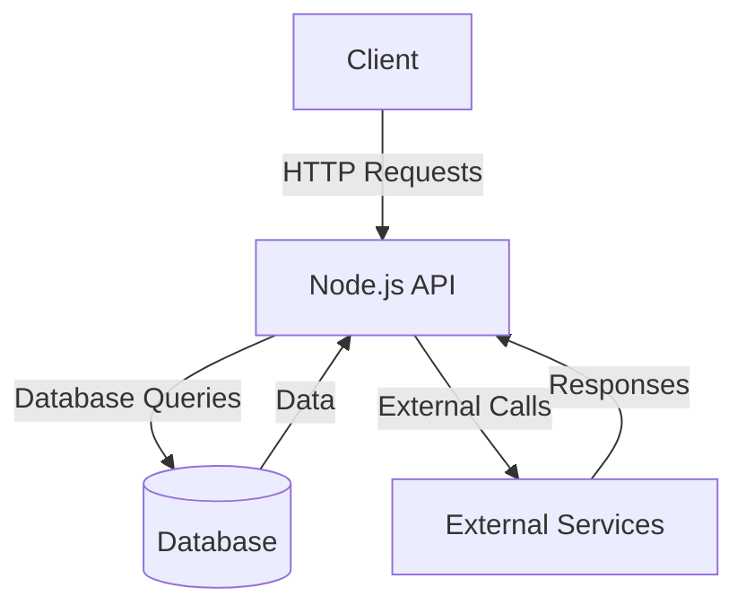

# Sample Node.js Application

This document provides an overview of a sample Node.js application. It includes a high-level architecture diagram and references for further reading.

## Architecture Overview

The following diagram illustrates the architecture of the Node.js application:



## Features

- RESTful API built with Express.js
- Database integration with MongoDB
- External API consumption
- Error handling and logging

## Installation

1. Clone the repository:
   ```bash
   git clone https://github.com/your-repo/sample-node-app.git
   ```
2. Install dependencies:
   ```bash
   cd sample-node-app
   npm install
   ```
3. Start the application:
   ```bash
   npm start
   ```

## References

- [Node.js Documentation](https://nodejs.org/en/docs/)
- [Express.js Guide](https://expressjs.com/)
- [MongoDB Documentation](https://www.mongodb.com/docs/)
- [Mermaid Documentation](https://mermaid-js.github.io/mermaid/)
